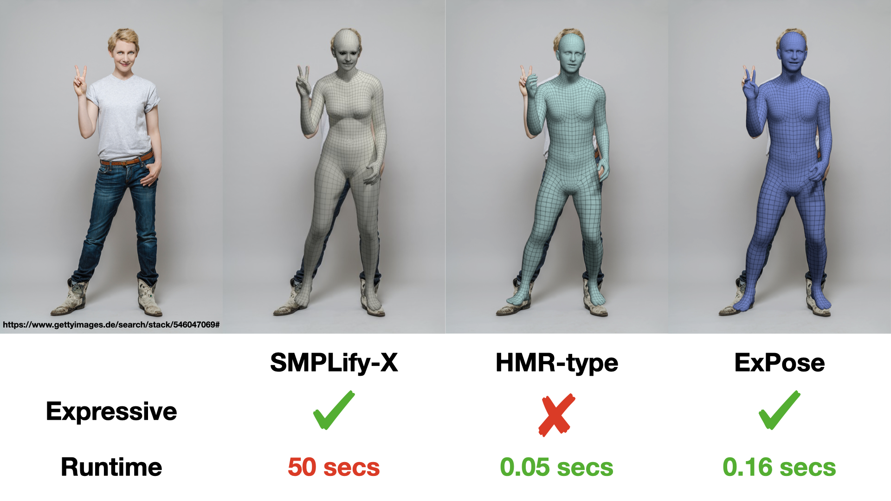
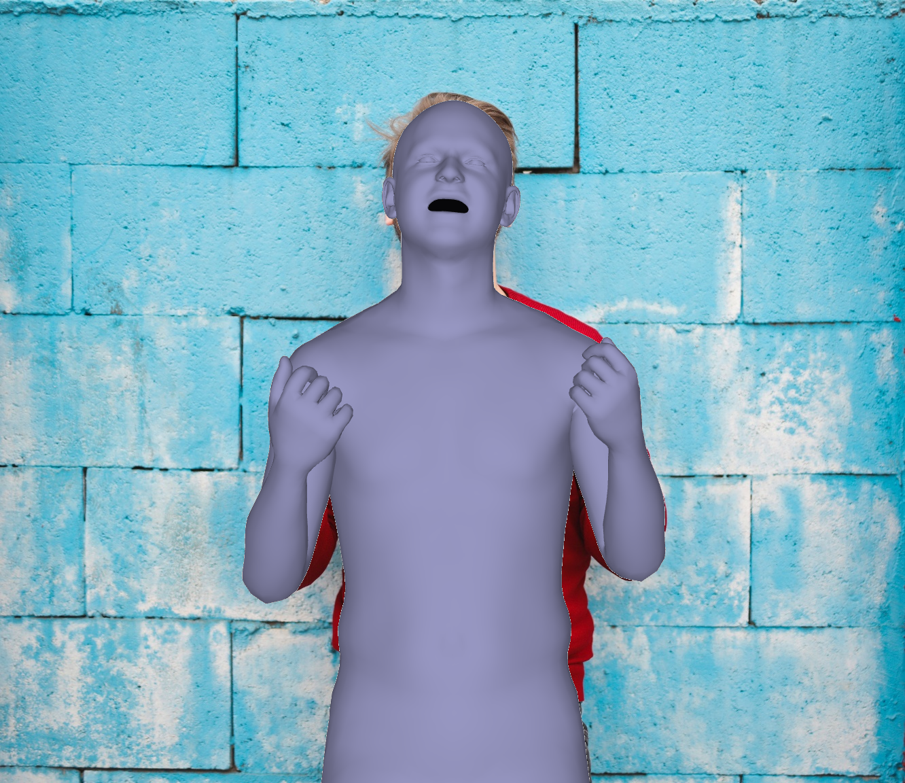

## ExPose: Monocular Expressive Body Regression through Body-Driven Attention

[](https://arxiv.org/abs/2008.09062)

[[Project Page](https://expose.is.tue.mpg.de/)] 
[[Paper](https://ps.is.tuebingen.mpg.de/uploads_file/attachment/attachment/620/0983.pdf)]
[[Supp. Mat.](https://ps.is.tuebingen.mpg.de/uploads_file/attachment/attachment/621/0983-supp_no_header_compressed.pdf)]



| Short Video | Long Video |
| --- | --- |
|  [](https://www.youtube.com/watch?v=a-sVItuoPek) | [](https://www.youtube.com/watch?v=lNTmHLYTiB8) | 

## Table of Contents
  * [License](#license)
  * [Description](#description)
    * [Dependencies](#dependencies)
    * [Preparing the data](#preparing-the-data)
    * [Demo](#demo)
    * [Inference](#inference)
  * [Citation](#citation)
  * [Acknowledgments](#acknowledgments)
  * [Contact](#contact)


## License

Software Copyright License for non-commercial scientific research purposes.
Please read carefully the following [terms and conditions](LICENSE) and any accompanying
documentation before you download and/or use the ExPose data, model and
software, (the "Data & Software"), including 3D meshes, images, videos,
textures, software, scripts, and animations. By downloading and/or using the
Data & Software (including downloading, cloning, installing, and any other use
of the corresponding github repository), you acknowledge that you have read
these [terms and conditions](LICENSE), understand them, and agree to be bound by them. If
you do not agree with these [terms and conditions](LICENSE), you must not download and/or
use the Data & Software. Any infringement of the terms of this agreement will
automatically terminate your rights under this [License](LICENSE).

## Description

**EX**pressive **PO**se and **S**hape r**E**gression (ExPose) is a method
that estimates 3D body pose and shape, hand articulation and facial expression
of a person from a single RGB image. For more details, please see our ECCV paper
[Monocular Expressive Body Regression through Body-Driven Attention](https://expose.is.tue.mpg.de/).
This repository contains:
* A PyTorch demo to run ExPose on images.
* An inference script for the supported datasets.

## Installation

To install the necessary dependencies run the following command:
```shell
    pip install -r requirements.txt
```
The code has been tested with two configurations: a) with Python 3.7, CUDA 10.1, CuDNN 7.5 and PyTorch 1.5 on Ubuntu 18.04, and b) with Python 3.6, CUDA 10.2 and PyTorch 1.6 on Ubuntu 18.04. 


### Preparing the data

First, you should head to the [project website](https://expose.is.tue.mpg.de/) and create an account.
If you want to stay informed, please opt-in for email communication 
and we will reach out with any updates on the project.
Once you have your account, login and head to the download section
to get the pre-trained **ExPose** model.
Create a folder named *data* and extract the downloaded zip there.
You should now have a folder with the following structure:
```bash
data
├── checkpoints
├── all_means.pkl
├── conf.yaml
├── shape_mean.npy
├── SMPLX_to_J14.pkl
```
For more information on the data, please read the [data documentation](doc/data.md).
If you don't already have an account on the [SMPL-X website](https://smpl-x.is.tue.mpg.de/), 
please register to be able to download the model. Afterward, extract the SMPL-X model
zip inside the data folder you created above.
```bash
data
├── models
│   ├── smplx
```
You are now ready to run the demo and inference scripts.

### Demo 

We provide a script to run **ExPose** directly on images. 
To get you started, we provide a sample folder, taken from [pexels](https://pexels.com),
which can be processed with the the following command:
```shell
    python demo.py --image-folder samples \
    --exp-cfg data/conf.yaml \
    --show=False \
    --output-folder OUTPUT_FOLDER \
    --save-params [True/False] \
    --save-vis [True/False] \
    --save-mesh [True/False]
```
The script will use a *Keypoint R-CNN* from *torchvision* to detect people in
the images and then produce a SMPL-X prediction for each using **ExPose**.
You should see the following output for the sample image:

|   |  | 
| --- | --- |

### Inference

The [inference](inference.py) script can be used to run inference on one of the supported
datasets. For example, if you have a folder with images and OpenPose keypoints
with the following structure:
```bash
folder
├── images
│   ├── img0001.jpg
│   └── img0002.jpg
│   └── img0002.jpg
├── keypoints
│   ├── img0001_keypoints.json
│   └── img0002_keypoints.json
│   └── img0002_keypoints.json
```
Then you can use the following command to run ExPose for each person:
```shell
python inference.py --exp-cfg data/conf.yaml \
           --datasets openpose \
           --exp-opts datasets.body.batch_size B datasets.body.openpose.data_folder folder \
           --show=[True/False] \
           --output-folder OUTPUT_FOLDER \
           --save-params [True/False] \
           --save-vis [True/False] \
           --save-mesh [True/False]
```
You can select if you want to save the estimated parameters, meshes, and renderings by 
setting the corresponding flags. 
 
## Citation

If you find this Model & Software useful in your research we would kindly ask you to cite:

```bibtex
@inproceedings{ExPose:2020,
    title= {Monocular Expressive Body Regression through Body-Driven Attention},
    author= {Choutas, Vasileios and Pavlakos, Georgios and Bolkart, Timo and Tzionas, Dimitrios and Black, Michael J.},
    booktitle = {European Conference on Computer Vision (ECCV)},
    year = {2020},
    url = {https://expose.is.tue.mpg.de}
}
```
```bibtex
@inproceedings{SMPL-X:2019,
    title = {Expressive Body Capture: 3D Hands, Face, and Body from a Single Image},
    author = {Pavlakos, Georgios and Choutas, Vasileios and Ghorbani, Nima and Bolkart, Timo and Osman, Ahmed A. A. and Tzionas, Dimitrios and Black, Michael J.},
    booktitle = {Proceedings IEEE Conf. on Computer Vision and Pattern Recognition (CVPR)},
    year = {2019}
}
```

## Acknowledgments

We thank Haiwen Feng for the FLAME fits,
Nikos Kolotouros, Muhammed Kocabas and Nikos Athanasiou for helpful discussions,
Sai Kumar Dwivedi and Lea Muller for proofreading,
Mason Landry and Valerie Callaghan for video voiceovers.

## Contact
The code of this repository was implemented by [Vassilis Choutas](mailto:vassilis.choutas@tuebingen.mpg.de).

For questions, please contact [expose@tue.mpg.de](mailto:expose@tue.mpg.de). 

For commercial licensing (and all related questions for business applications), please contact [ps-licensing@tue.mpg.de](mailto:ps-licensing@tue.mpg.de).
